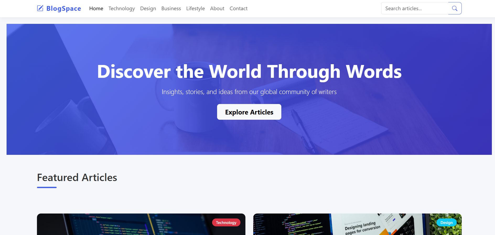
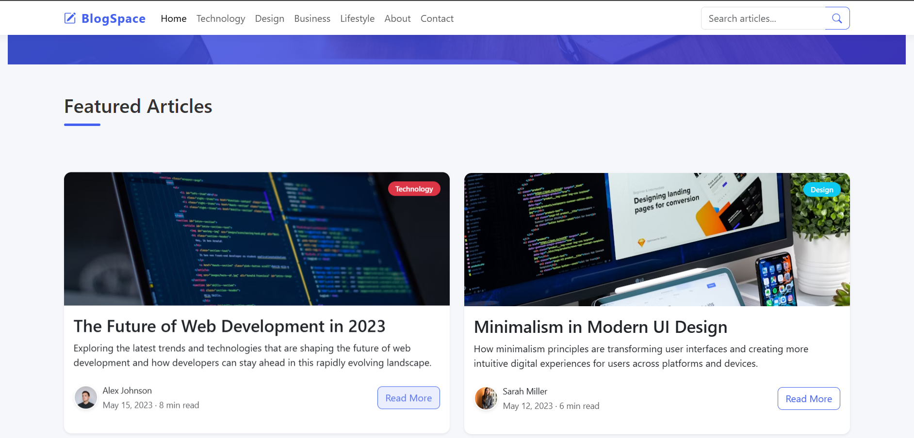
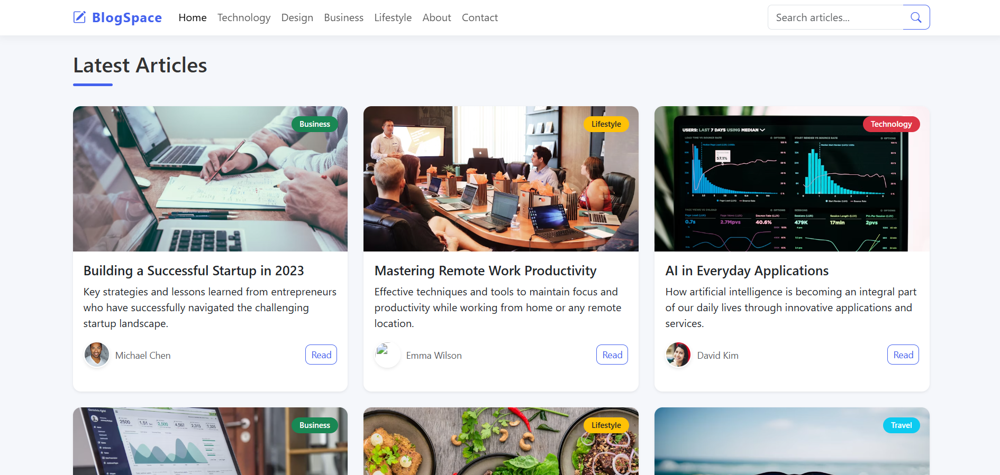
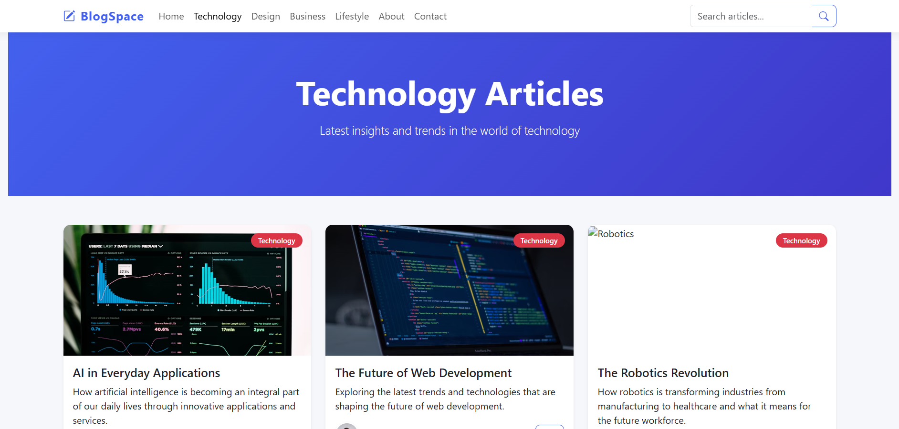
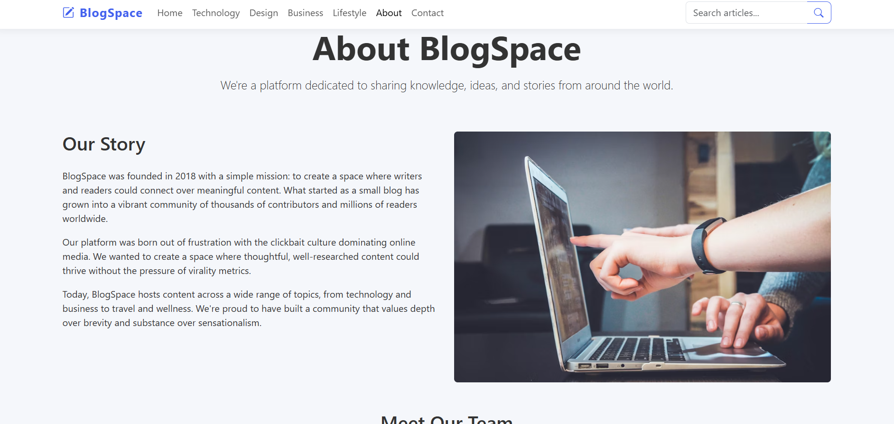
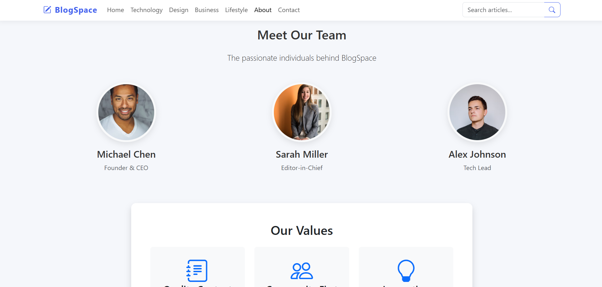
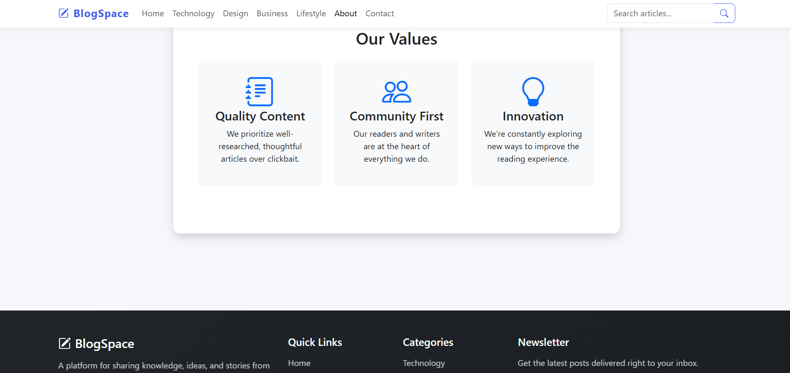
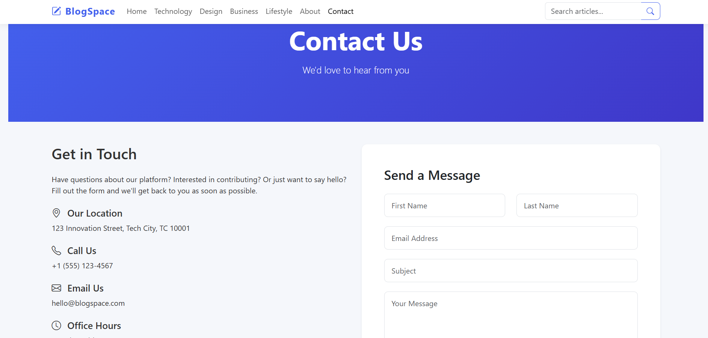

# Bootstrap 5 Blog Website



A responsive blog website built with Bootstrap 5. This project features a modern blog layout with functional navigation, article cards, category pages, and a contact form. Perfect for showcasing your content creation skills and Bootstrap proficiency.

## Features

- **Responsive Design**: Works seamlessly on mobile, tablet, and desktop devices
- **Multiple Pages**: Home, Articles, Categories, About, and Contact pages
- **Interactive Elements**: Functional navigation, like buttons, and contact form
- **Modern UI**: Clean design with hover effects and animations
- **Bootstrap 5 Components**: Navbar, Cards, Grid System, Forms, and Pagination
- **Dark Mode Footer**: Elegant footer with newsletter subscription

## Technologies Used

- HTML5
- CSS3
- JavaScript
- [Bootstrap 5](https://getbootstrap.com/)
- [Bootstrap Icons](https://icons.getbootstrap.com/)

## Installation

1. Clone the repository:
```bash
git clone https://github.com/ajaymkoli/Blog-Post.git
```

2. Navigate to project directory:
```bash
cd Blog-Post
```

3. Open `index.html` in your browser

## Project Structure

```
bootstrap5-blog/
├── index.html              # Main HTML file
├── style.css               # Responsive styles
├── script.js               # JavaScript functionality
├── README.md               # Project documentation
└── LICENSE                 # MIT License
```

## Usage

1. The home page displays featured articles and latest posts
2. Click on "Read More" to view full articles
3. Use the navigation menu to explore different categories
4. Visit the About page to learn about the blog
5. Use the Contact page to send messages
6. Subscribe to the newsletter in the footer

## Customization

You can customize the blog by:

1. Modifying the color scheme in `style.css`:
```css
:root {
  --primary-color: #4361ee;
  --secondary-color: #3f37c9;
  --accent-color: #4cc9f0;
}
```

2. Adding new articles in the HTML file:
```html
<div class="col-md-6 col-lg-4">
  <div class="card shadow-sm">
    <div class="position-relative">
      <div class="card-img-container">
        
      </div>
      <span class="badge bg-info category-badge">Category</span>
    </div>
    <div class="card-body">
      <h5 class="card-title">Article Title</h5>
      <p class="card-text">Article description</p>
      <div class="d-flex justify-content-between align-items-center mt-3">
        <div class="d-flex align-items-center">
          
          <div>
            <small class="text-muted">Author Name</small>
          </div>
        </div>
        <a href="#article-id" class="btn btn-sm btn-outline-primary" data-page="article">Read</a>
      </div>
    </div>
  </div>
</div>
```

3. Updating the navigation menu:
```html
<ul class="navbar-nav me-auto">
  <li class="nav-item">
    <a class="nav-link" href="#home" data-page="home">Home</a>
  </li>
  <!-- Add your custom menu items here -->
</ul>
```

## Screenshots

### Home Page


### Featured Articles


### Blog Posts


### Technology Page


### About us Page




### Contact Page


## License

This project is licensed under the MIT License - see the [LICENSE](LICENSE) file for details.


**Internship Task Note**: This project was created as part of my internship submission to demonstrate proficiency in:
- Building responsive layouts with Bootstrap 5
- Implementing interactive components
- Creating multi-page navigation
- Following modern web development practices
- Writing clean and maintainable code
